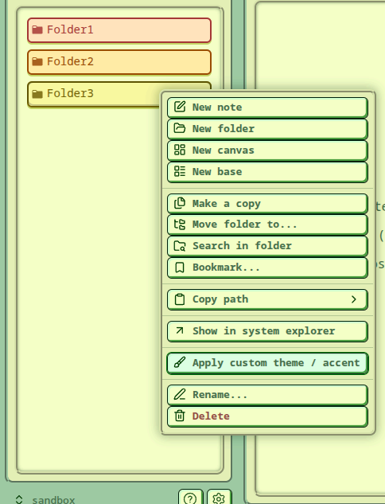
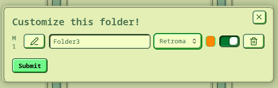
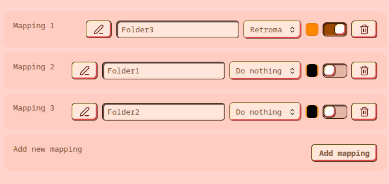

# Accent & Theme Customizer
An Obsidian plugin that allows you to assign different accent colors and themes to different folders!

### Context menu
You can customize this plugin directly from the file explorer. Just right-click on a folder you want to customize and you're done.

You will be presented with this simple settings tab:

Here you can pick what to customize. Accent color and theme don't both have to be customized - you can leave either one as is.

### Settings 
When you open the plugin settings you can quickly preview your mappings and make changes there as well.

